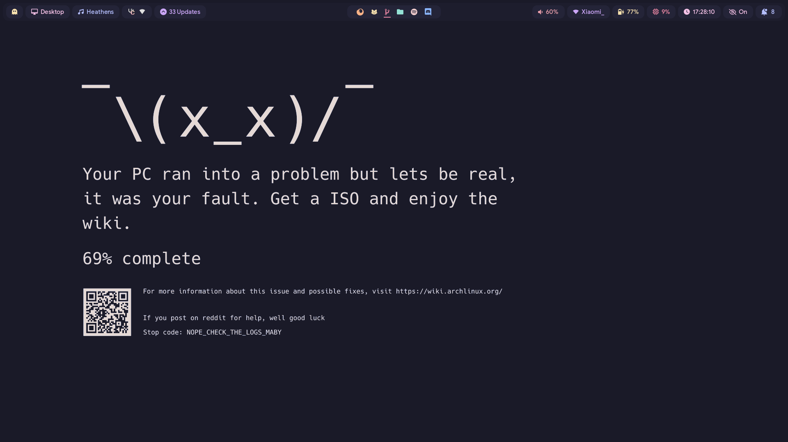
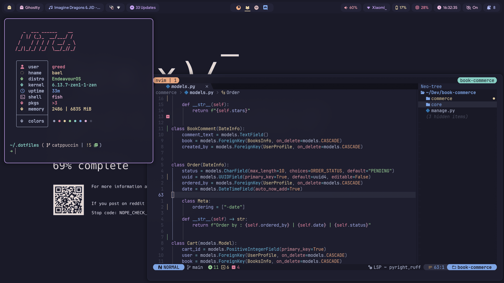
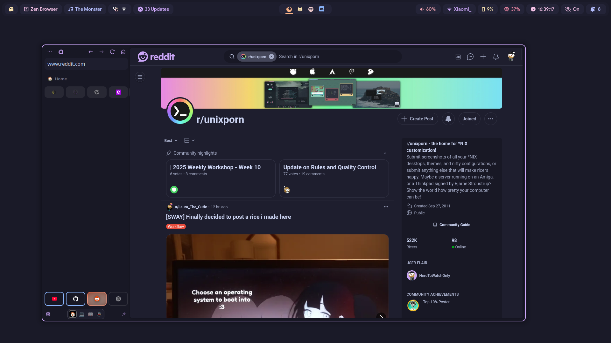
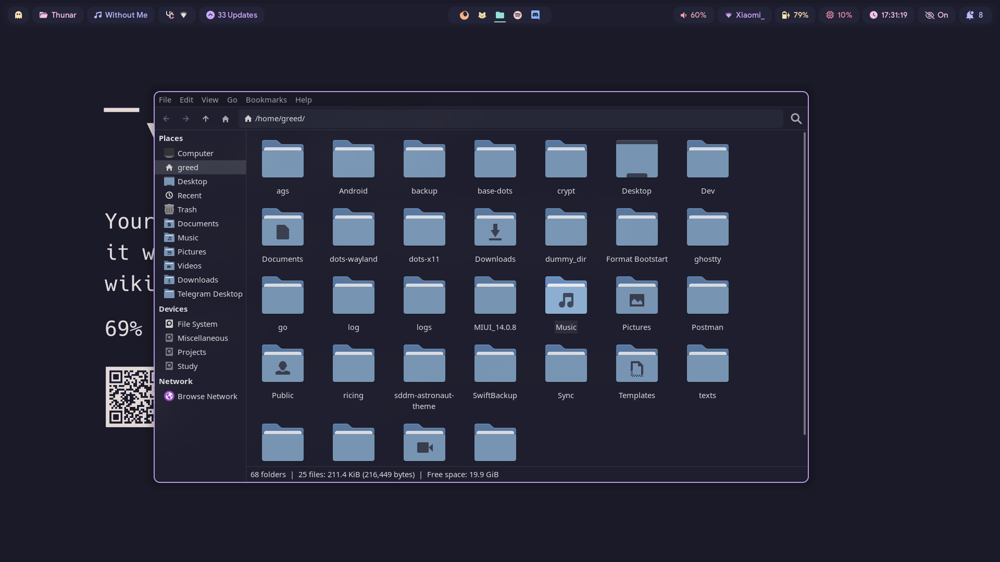
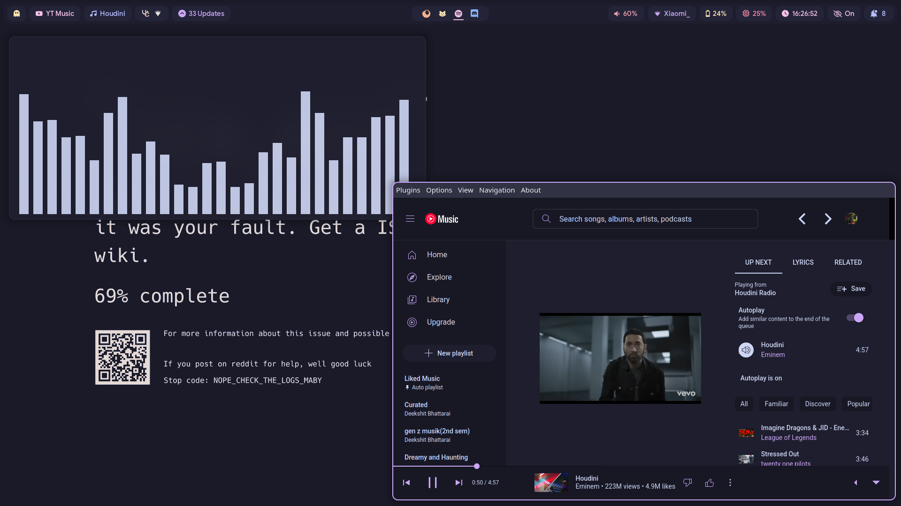
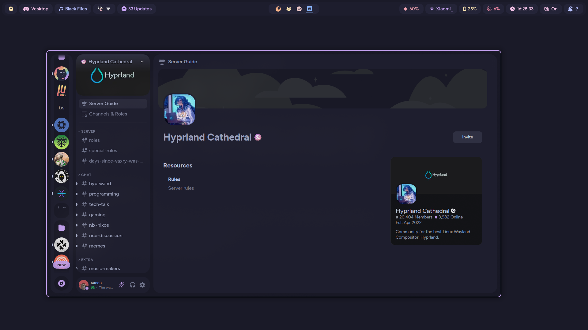
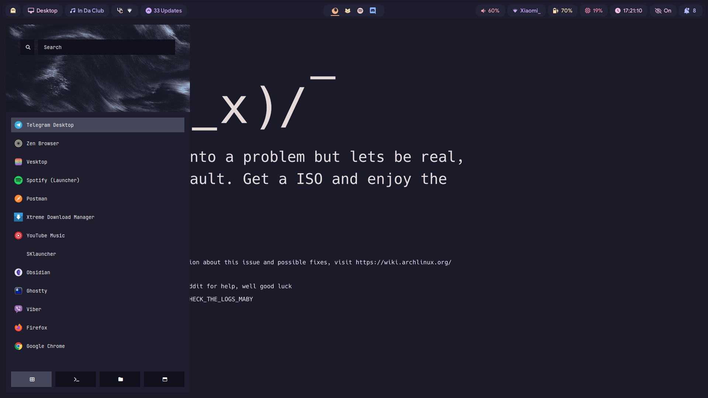

# Hyprland Dots

## 🛠️ Stuffs used

|  Stuffs used   |                                      Links                                  |
| :------------: | :--------------------------------------------------------:                  |
|   AUR Helper       |[paru](https://github.com/Morganamilo/paru)                              |
|    Browser         |[Zen Browser](zen-browser.app)                                           |
|     Terminal       |[ghostty](https://ghostty.org/)                                          |
|       Panel        |[HyprPanel](https://github.com/Jas-SinghFSU/HyprPanel)                   |
|   Discord Client   |[vesktop](https://github.com/Vencord/Vesktop)                            |
|     Fetch          |[nitch](https://github.com/ssleert/nitch)                                |
|   Music Streamer   |[YT Muisc](https://github.com/th-ch/youtube-music)                       |
| File Explorer      |thunar                                                                   |
|       Rofi         |[lbonn's fork for wayland](https://github.com/lbonn/rofi)                |
|   GTK theme        |[catppuccin](https://github.com/catppuccin/gtk)                          |
|Wallpaper Collection|[orangci's collection](https://github.com/orangci/walls-catppuccin-mocha)|

## 🖼️ Screenshots

### Wallpaper


### Fetch & [Neovim](https://github.com/greed-d/nvim-minimal?tab=readme-ov-file)


### Browser


### Thunar

### YT Music


### Discord

### Rofi


## 💻 Installation

### Install hyprland and other required packages
#### Pacman
```bash
sudo pacman -S hyprland hypridle hyprlock pacman-contrib ghostty thunar spotify-launcher fish ttf-jetbrains-mono-nerd thunar cliphist brightnessctl wireplumber playerctl tmux
```
#### AUR

```
paru -S ags-hyprpanel-git rofi-lbonn-wayland-only-git youtube-music-bin vesktop-bin
```

> [!NOTE]  
> More packages may be needed to be installed in order for WM to work properly

#### Install Stow

```bash
sudo pacman -S stow
```

#### Clone the repo :

```bash
git clone https://github.com/greeid/.dotfiles ~/.dotfiles/ -b catppuccin --depth=1
```

#### Stow the repo

```bash
cd ~/.dotfiles/
stow hypr/ alacritty/ fish/ scripts/ rofi/ hyprpanel/ scripts/
```

